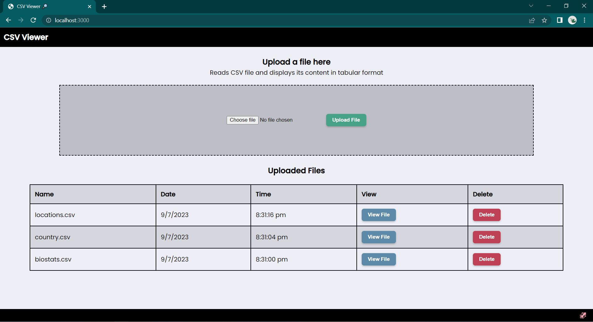
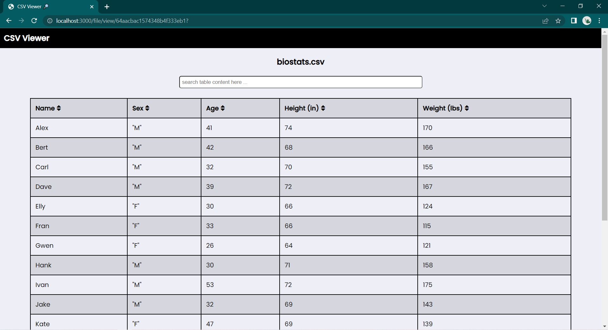
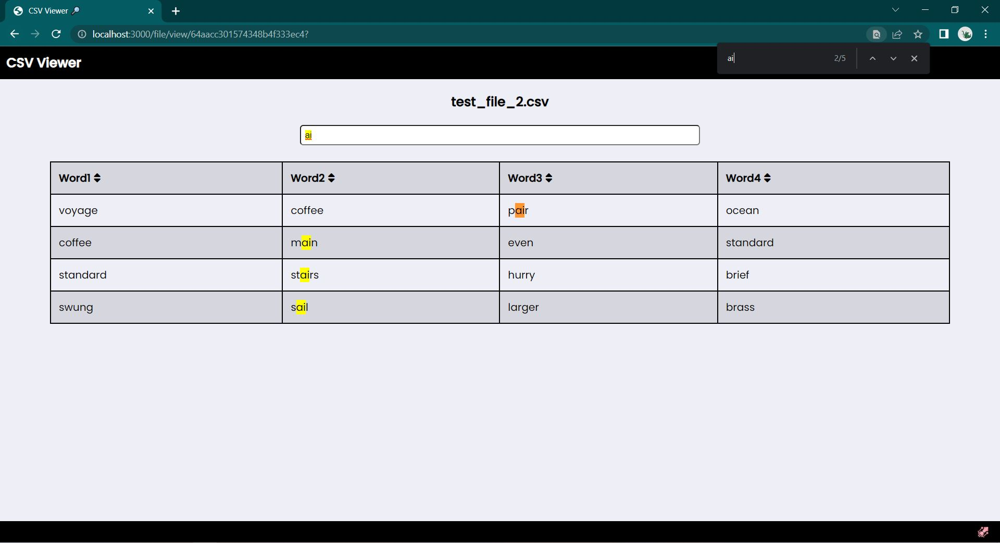
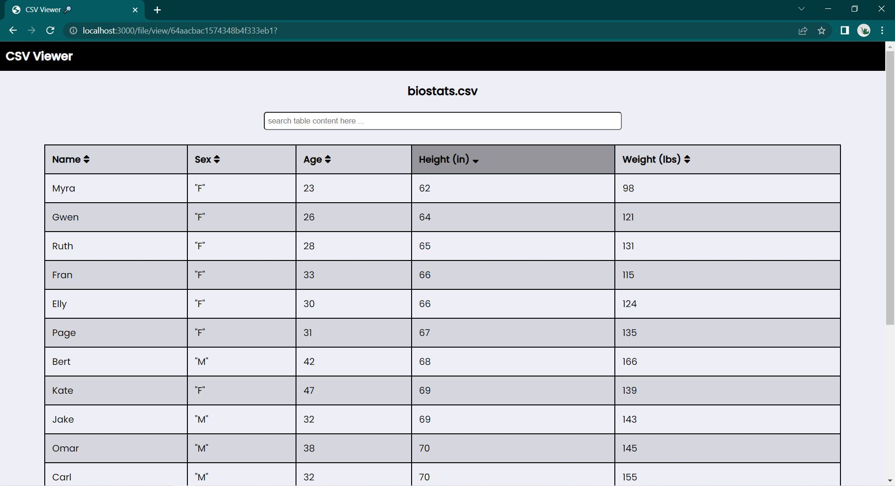

# CSV Viewer Project

Access this project live here --> https://gorgeous-coat-bat.cyclic.app/

This is a CSV reader application where you can upload a CSV file and get it's content displayed in a tabular format.
When you view a file you have an option to search the table. The table would be filtered according to the search query.
Clicking on any of the headers of the file you can sort the table in ascending or descending order.

## Tech Stack

This project uses NodeJs for backend routing with EJS templating engine for frontend.
Multer is used for assisting with file uploads and CSV Parser is used to parse the CSV files before storing to DB.
For database configuration, this project uses MongoDB.
Styling is done using vanilla CSS.

## Local Machine Setup

To run this application in your local machine, please follow the below steps. Your machine should have MongoDB setup as this application uses MongoDB for database needs.

1 - Clone the repository using the following command
git clone https://github.com/vibhavk03/csv-viewer.git

2 - Install the required dependencies using the following command
npm install

3 - Create a .env file and paste the following key-value into it
MONGO_URI=mongodb://127.0.0.1:27017/csv_viewer_local

3 - Start the application using the following command
npm run start
npm run dev (to start using nodemon)

4 - Open the application in your web browser by going to the below URL
http://localhost:3000/
